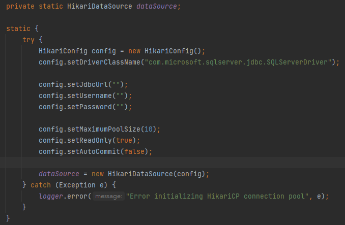
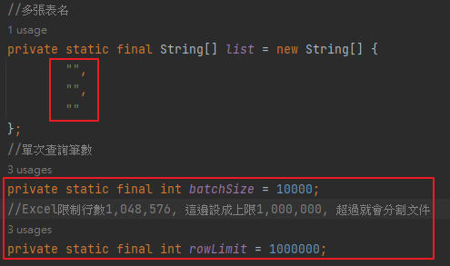

## Convert table to excel
就MSSQL表匯出Excel  
工作需求寫的工具  
要把資料庫表匯出excel  
直接對應欄位和值  
輸出值有把Big5的UnitCode統一轉utf-8  
使用方式就輸入對應資料庫(目前是MSSQL) table name，直接執行exec  
 
---
因應大量數據(目前測試到百萬級別)  
做成連線池+多執行序的方式下去跑  
搜尋方式用分頁筆數不做全搜不然內存會爆掉  
因為怕單一文件同時存取會有衝突的問題，就沒多工執行  
只能做到每個Excel分別動作  
單一Excel上限目前是設置999,999行  
超出部分就會建新的Excel放
如果筆數百萬運行最快大概也要一小時, 還在優化    
單次搜尋筆數和每個Excel行數都能做設置  
